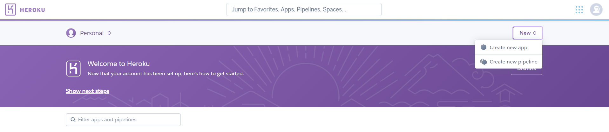
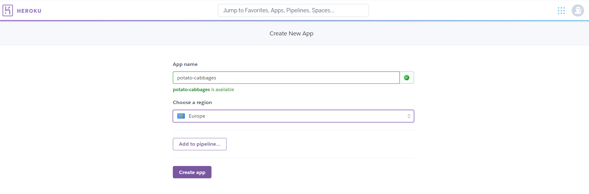

# **Boutique Ado**

# Overview
Code along with Code Instutute instructor to build an e-commerce site using Python/Django.

# Index
1. [UX](#ux)
1. [Deployment of the Application](#deployment)
    * [Cloning via GitPod](#cloning-a-project-into-gitpod)
    * [Cloning Locally](#how-to-run-the-code-locally)
1. [Technologies Used](#technologies-used)
1. [Credits](#credits)
    * [Website](#website-credits)
    * [README](#readme-credits)

## UX

### **Overview and Broad Design Choices**
Design, structure and style will all have been planned by the CI team when preparing the tutorial.  None was undertaken by the student for this project.

## Deployment

The website was created using [GitPod](https://www.gitpod.io/). Version control was undertaken by committing to [Git](https://git-scm.com/) and pushing to [GitHub](https://github.com/) using the functions within GitPod.  [Heroku]((https://heroku.com/)) was used to deploy the live site.

### **Deployment of the Page**
Continuous deployment via GitHub-Heroku link was utilised for this project.  As such, deployment was amongst the first tasks undertaken.
1. In the IDE, ensure that a small test application exists, and all changes are committed and pushed to GitHub.
1. Create a requirements file, which will be used by Heroku in creation of the deployment.
    * In the terminal, type "pip3 freeze --local > requirements.txt".
    * Commit this to Git.
1. Create a Procfile, which is used by Heroku to determine the language for the app.
    * In the terminal, type "echo web: python app.py > Procfile".
    * This is case sensitive, and should have a capital P, and should have no file extension.
    * Commit this to Git.
1. Push these files to GitHub.
1. [Sign in to Heroku](https://id.heroku.com/login) (or [create a Heroku account](https://signup.heroku.com/) if you do not already have one), and choose "New > Create New App".

1. Choose an app name, which must be unique, and select the nearest region.  Then click "Create App".

1. Once generated choose the "Deploy" tab, select "Connect to GitHub" sub-tab and click the "Connect to GitHub" button.

1. Follow the on-screen instructions to link Heroku to your GitHub account.
1. Click the "Settings" tab from the main menu, and scroll down to find "Reveal Config Vars".  This section should be populated with any sensitive data which is not appropriate to send to GitHub, usually in an "env.py" document.

1. Back on the Deploy tab, once linked, Heroku will prompt for the repository name, complete this and click "Search".

1. The repo listing should appear, click "Connect".
1. Heroku will process the request before showing that the connection has been made successfully, and showing two new options.  Click the first of these, which is to "Enable Automatic Deploys".

1. The second option is to "Deploy Branch".  Click the button and Heroku will process for some time.

1. Once complete, Heroku will display a checklist, followed by a "View" button.  Click this to open the app in a new tab.

1. Celebrate! Your app should now update in line with any changes pushed to GitHub.

### **How to Clone and Run the Code Locally**
There are slightly different approaches should you choose to use GitPod to clone the project, or a local IDE.

#### Cloning a Project into GitPod
1. Use [Google Chrome](https://www.google.com/intl/en_uk/chrome/). *(This can also be undertaken in Firefox)*
1. If you do not already have one, [create a GitHub account](https://github.com/join).
1. Install the [GitPod browser extension for Chrome](https://chrome.google.com/webstore/detail/gitpod-dev-environments-i/dodmmooeoklaejobgleioelladacbeki). *(Or Firefox if appropriate)*
1. Restart Chrome.
1. In GitHub, find the [project repository](https://github.com/lilblupig/ci-16-boutique-ado-v1).
1. From the repository menu, choose the green GitPod button.

1. A new GitPod workspace will open containing the project code.

#### Cloning a Project into a Local IDE
1. Navigate to the [GitHub Repository](https://github.com/ci-14-task-manager).
1. Choose the Code dropdown menu, and copy the URL.

1. Open your local IDE and then open a terminal.
1. Set the current working directory to your preferred location for the cloned project.
1. Type in "git clone " followed by the copied URL. Be sure to include a space between git clone and the url, then press enter.
1. The cloned project will be created.

You can find more information on cloning a repository from GitHub [here](https://docs.github.com/en/github/creating-cloning-and-archiving-repositories/cloning-a-repository).

## Technologies Used

### **Languages**
* HTML5 is used to provide the basic structure of the website.
  * About: [HTML5 Wiki](https://en.wikipedia.org/wiki/HTML5)
  * Creator: [W3 Consortium](https://www.w3.org/)
* CSS3 is used to provide most of the styling for the website.
  * About: [CSS3 Wiki](https://en.wikipedia.org/wiki/CSS)
  * Creator: [W3 Consortium](https://www.w3.org/)
* JavaScript is used to provide the interactive nature of such components throughout the website.
  * About: [JavaScript Home](https://www.javascript.com/)
* Python is the primary programming language used to create the application.
  * About: [Python Home](https://www.python.org/)

### **Libraries and Frameworks**
* The [Django](https://www.djangoproject.com/) framework is used to facilitate efficient app building and include basic security.
* [Bootstrap](https://getbootstrap.com/) is used to provide the grid functionality for uniform design, responsiveness and to enable the use of modal and hamburger menu.
* [jQuery](https://jquery.com/) is used to simplify the implementation of interactive JavaScript components.
* [Font Awesome](https://fontawesome.com/) is used to provide some of the icons for the website.

### **Tools**
* [Git](https://git-scm.com/)/[GitHub](https://github.com/) was used for version control and repository storage.
* [GitPod](https://www.gitpod.io/) was the IDE used to write the project.
* [Chrome Dev Tools](https://developers.google.com/web/tools/chrome-devtools) were used for specific responsiveness testing and drilling down into bug fixing.

### **Other Resources**
* [Code Institute Full Template](https://github.com/Code-Institute-Org/gitpod-full-template) was used to set up the repository.

## Credits

### **Website Credits**

#### Content
Where did the website content come from?  The website content was taken from the course materials.

### **README Credits**

#### Content
Structure and content based heavily on:
* [Code Institute Solutions - README Template](https://github.com/Code-Institute-Solutions/readme-template)

#### Media
The images for this README are from the following sources:
* Snips taken from GitHub.

#### Other
* Markdown basic taken from [Mastering Markdown](https://guides.github.com/features/mastering-markdown/).

**This website was produced as an educational project for the Code Institute Full Stack Development course.**

**Created by Amy Hacker.**

[Back to Top](#boutique-ado)